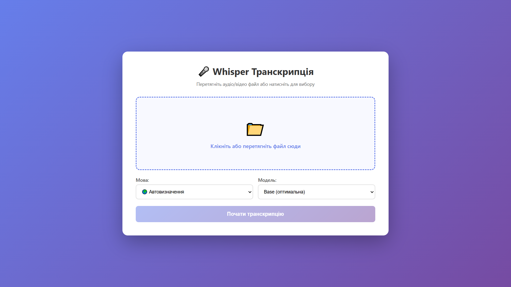
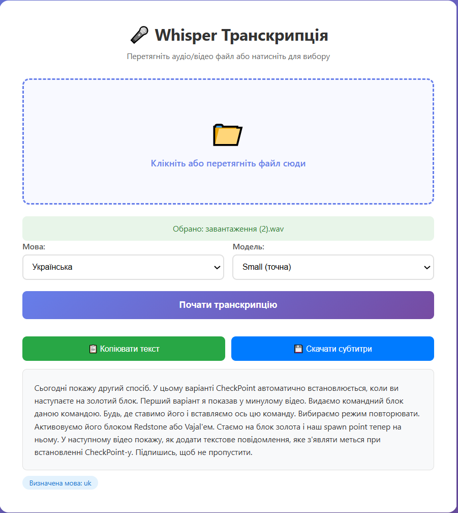
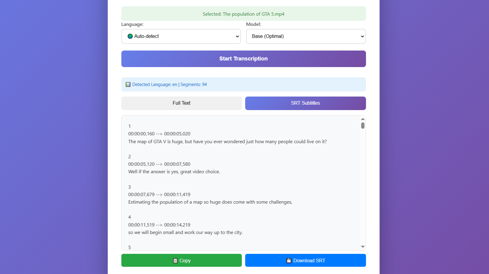

[README.md](https://github.com/user-attachments/files/22853418/README.md)
# 🎤 Whisper Transcription Web App

[](https://www.python.org/downloads/)
[](https://flask.palletsprojects.com/)
[](https://github.com/openai/whisper)
[](https://opensource.org/licenses/MIT)

> 🤖 **Увага:** Цей проєкт повністю написаний штучним інтелектом, включаючи весь код та README. Створено для ознайомчих цілей можливостей сучасного AI

Веб-додаток для автоматичної транскрипції аудіо та відео файлів з використанням моделі OpenAI Whisper. Підтримує українську, російську, англійську та японську мову.



## ✨ Можливості

- 🎵 **Підтримка форматів:** WAV, MP3, MP4, AVI, MKV, FLAC, M4A, OGG, WebM
- 🌍 **Багатомовність:** підтримка 100+ мов
- 📝 **Генерація субтитрів:** автоматичне створення .SRT файлів
- 🖱️ **Drag & Drop:** зручне завантаження файлів перетягуванням
- ⚡ **Прогрес-бар:** відстеження процесу транскрипції в реальному часі
- 🎯 **Вибір моделі:** від швидких до найточніших варіантів

## 🧠 Моделі Whisper

| Модель | Швидкість | Точність | Пам'ять (RAM) | VRAM | Рекомендації |
|--------|-----------|----------|---------------|------|--------------|
| `tiny` | ⚡⚡⚡⚡ | 🟡 середня | ~1 GB | - | Для швидких тестів і коротких файлів |
| `base` | ⚡⚡⚡ | 🟢 добра | ~2 GB | - | **Оптимальний вибір** для більшості випадків |
| `small` | ⚡⚡ | 🟢 висока | ~3 GB | - | Якщо потрібна краща точність |
| `medium` | ⚡ | 🟢 дуже висока | ~5 GB | 2GB | Для професійної транскрипції |
| `large` | 🐢 | 🟢 найкраща | ~10 GB | 5GB | Максимальна якість (потрібна потужна система) |

### 💡 Вибір моделі залежно від ваших ресурсів:

- **4 GB RAM:** використовуйте `tiny` або `base`
- **8 GB RAM:** можна використовувати `small` або `medium`
- **16+ GB RAM:** доступні всі моделі, включаючи `large`
- **GPU NVIDIA:** значно прискорює роботу всіх моделей (автоматично використовується, якщо доступна)

> ⚠️ **Примітка:** Моделі `medium` та `large` працюватимуть повільно без достатньо потужного процесора або GPU. Для більшості завдань рекомендується модель `base`.

## 📸 Приклади роботи

### Результат транскрипції




## 🚀 Швидкий старт

### Вимоги

- Python 3.11 (Обов'язково, інакше не працюватиме)
- FFmpeg (для обробки відео)
- 4+ GB RAM (залежно від моделі)

### Встановлення FFmpeg

**Windows:**
```bash
# Завантажте з https://ffmpeg.org/download.html
# Або через Chocolatey:
choco install ffmpeg
```

**macOS:**
```bash
brew install ffmpeg
```

**Linux (Ubuntu/Debian):**
```bash
sudo apt-get update
sudo apt-get install ffmpeg
```

### Встановлення додатку

1. **Клонуйте репозиторій:**
```bash
git clone https://github.com/BlackPencil-69/Whisper-Transcription-Web-App.git
cd Whisper-Transcription-Web-App
```

2. **Створіть віртуальне середовище:**
```bash
py -3.11 -m venv venv
```

3. **Активуйте віртуальне середовище:**

**Windows:**
```bash
venv\Scripts\activate
```

**macOS/Linux:**
```bash
source venv/bin/activate
```

4. **Встановіть залежності:**
```bash
pip install -r requirements.txt
```

5. **Запустіть сервер:**
```bash
python app.py
```

6. **Відкрийте браузер:**
```
http://localhost:5000
```

### 📱 Доступ з мобільного пристрою

Для доступу з телефону в локальній мережі:

1. Дізнайтесь IP-адресу вашого комп'ютера:
   - **Windows:** `ipconfig` (шукайте IPv4 Address)
   - **macOS/Linux:** `ifconfig` або `ip addr`

2. На телефоні відкрийте: `http://<IP-вашого-комп'ютера>:5000`

Приклад: `http://192.168.1.100:5000`

## 📖 Використання

1. **Завантажте файл:** Перетягніть аудіо/відео файл або натисніть для вибору
2. **Оберіть мову:** Українська, російська, англійська, японська
3. **Оберіть модель:** Від `tiny` (швидка) до `large` (найточніша)
4. **Натисніть "Почати транскрипцію"**
5. **Дочекайтесь результату:** Прогрес-бар покаже поточний стан
6. **Скопіюйте текст** або **завантажте .SRT субтитри**

## 🔧 Технології

- **Backend:** Flask (Python)
- **AI Model:** OpenAI Whisper
- **Media Processing:** FFmpeg
- **Frontend:** HTML5, CSS3, JavaScript (Vanilla)
- **UI/UX:** Responsive design, Drag & Drop API

## ⚙️ Конфігурація

Основні налаштування в `app.py`:

```python
UPLOAD_FOLDER = 'uploads'  # Папка для тимчасових файлів
MAX_FILE_SIZE = 500 * 1024 * 1024  # 500MB максимальний розмір
ALLOWED_EXTENSIONS = {'wav', 'mp3', 'mp4', 'avi', 'mkv', 'flac', 'm4a', 'ogg', 'webm'}
```

## 🐛 Вирішення проблем

### FFmpeg не знайдено
```bash
# Перевірте встановлення:
ffmpeg -version

# Якщо не працює, встановіть знову або додайте до PATH
```

### Помилка пам'яті (MemoryError)
- Використовуйте меншу модель (`tiny` або `base`)
- Закрийте інші програми
- Спробуйте файл меншого розміру

### Повільна транскрипція
- Використовуйте меншу модель
- Перевірте, чи використовується GPU (якщо доступна)
- Зменшіть розмір файлу

### Файл не завантажується
- Перевірте формат файлу (має бути в списку підтримуваних)
- Перевірте розмір (максимум 500MB)
- Переконайтесь, що файл не пошкоджений


## 📝 Ліцензія

Цей проєкт розповсюджується під ліцензією MIT. Дивіться файл `LICENSE` для деталей.

## 🙏 Подяки

- [OpenAI Whisper](https://github.com/openai/whisper) - за чудову модель розпізнавання мовлення
- [Flask](https://flask.palletsprojects.com/) - за простий та потужний веб-фреймворк
- [FFmpeg](https://ffmpeg.org/) - за обробку медіафайлів
- [Claude](https://claude.ai/) - за основний код
- [ChatGPT](https://chatgpt.com/) - за виправлення помилок
## 📧 Контакти

GitHub: [@BlackPencil-69](https://github.com/BlackPencil-69/)

Project Link: [https://github.com/BlackPencil-69/Whisper-Transcription-Web-App](https://github.com/BlackPencil-69/Whisper-Transcription-Web-App)

---

**⭐ Якщо цей проєкт був корисний, поставте зірочку!**

> 🤖 Цей проєкт створено з повним використанням штучного інтелекту для демонстрації можливостей AI у розробці програмного забезпечення.


